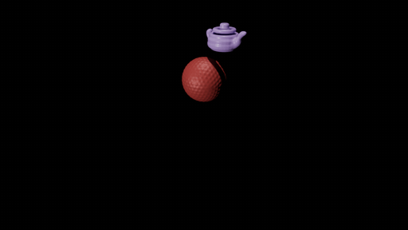
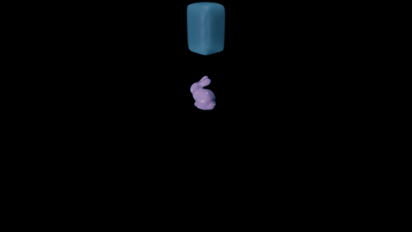
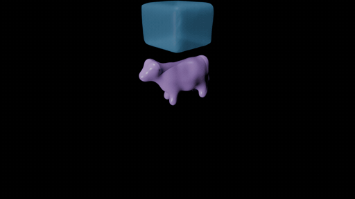
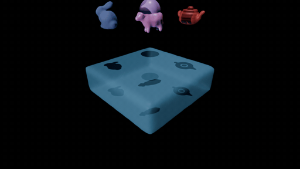
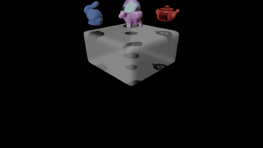

# Water-Collision Based on Material Point Method (MPM)

## Features:

- Basic coupling between rigid & rigid and rigid & fluid.
- Surface reconstruction that supports multiple rigid bodies and fluids in one scene.
- Video rendering pipeline (`.png` frames and `.mp4` videos / `.gif` images currently).
- Support JSON files for scene config. Pass in via the CLI `--scene-config YOUR_SCENE.json`.

## How to run:

```bash
python main.py --scene-config config/dambreak_hard_const.json
```

$\quad$ The frames will be exported to `frames/<out_dir>/frames_{%4d}.png` and the rendering result to `renderings/<out_dir>.mp4`.

## TODOs:

- Surface reconstruction. (Done)
- Add collision logic for walls (not only bottom). (Done)
- Read configuration files. (Done)
- Acceleration.
- Finetuning.

## Examples:

### Collision




### Fluid on Rigid




### Dambreak


### Rigid on Fluid




### Layering


### Jelly


### Snow


