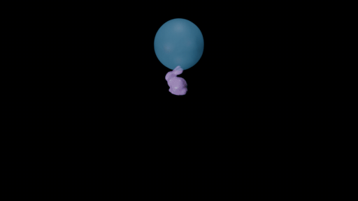
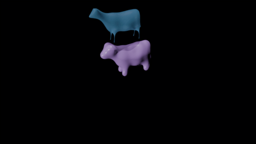
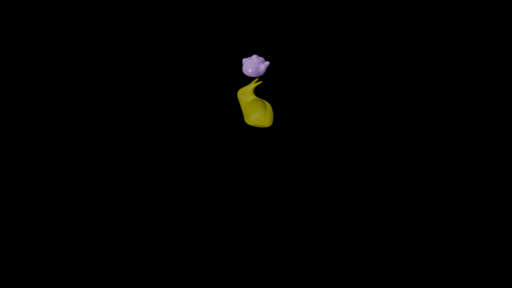

# Water-Collision Based on Material Point Method (MPM)

## Features:

- Basic coupling between rigid & rigid and rigid & fluid.
- Surface reconstruction that supports multiple rigid bodies and fluids in one scene.
- Video rendering pipeline (`.png` frames and `.mp4` videos / `.gif` images currently).
- Support JSON files for scene config. Pass in via the CLI `--scene-config YOUR_SCENE.json`.

## How to run:

$\quad$ The simulation requires a GPU-enabled environment.

```bash
conda create -n Water-Collision python=3.11
conda activate Water-Collision
pip install taichi torch tqdm ninja pysplashsurf

# install bpy for rendering
wget https://download.blender.org/pypi/bpy/bpy-5.0.0-cp311-cp311-manylinux_2_28_x86_64.whl
pip install bpy-5.0.0-cp311-cp311-manylinux_2_28_x86_64.whl
```

$\quad$ Note that `bpy` may require additional system-level dependencies, which can be installed using `apt`.

$\quad$ Use the following command to run the simulation:

```bash
python main.py --scene-config config/dambreak_hard_const.json
```

The file `dambreak_hard_const.json` can be replaced with any other `.json` configuration under the `config/` directory. Users may also define and use their own customized scene configuration files.

$\quad$ The frames will be exported to `frames/<out_dir>/frames_{%4d}.png` and the rendering result to `renderings/<out_dir>.mp4`.

## TODOs:

- Surface reconstruction. (Done)
- Add collision logic for walls (not only bottom). (Done)
- Read configuration files. (Done)
- Acceleration. (Done)
- Supporting different fluids and initialization. (Done)
- Finetuning. (Done)

## Examples:

### Collision


### Fluid on Rigid


### Dambreak


### Rigid on Fluid


### Layering


### Jelly


### Snow


### Initializing Fluid Blocks with Different Shapes




